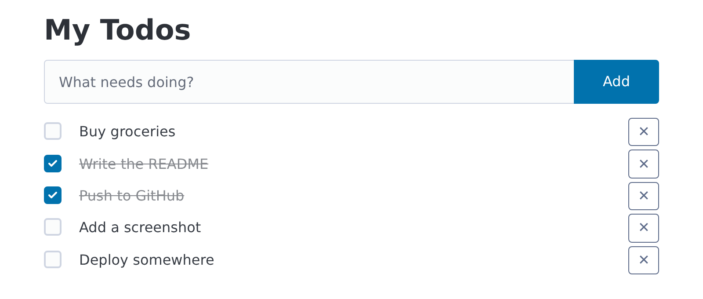

# fasthtml-todo

A small todo list built with [FastHTML](https://fastht.ml). Pages are rendered on the server,
[HTMX](https://htmx.org) swaps in just the parts that change, todos are stored in SQLite through
[fastlite](https://github.com/AnswerDotAI/fastlite), and the styling comes from [Pico CSS](https://picocss.com).
There's no JavaScript build step and no separate frontend.



## Requirements

- Python 3.13
- [uv](https://docs.astral.sh/uv/)

## Running

```sh
uv run main.py
```

Then open http://localhost:5001. uv installs the dependencies the first time you run it. The server
restarts on its own when you change a file.

The first run creates two files that git ignores:

- `data/todos.db` — the SQLite database. Delete it to start with an empty list.
- `.sesskey` — the secret FastHTML uses to sign session cookies. Keep it out of version control.

## Project layout

```
main.py            entrypoint: creates the app, registers routes, starts the server
app/
  routes.py        HTTP handlers
  components.py    HTML fragments (todo item, form, list)
  db.py            Todo dataclass and the SQLite table
static/style.css   styles added on top of Pico
docs/              README assets
```

## How it works

Every route returns HTML. HTMX attributes on the elements say where each response goes:

| Route                        | Triggered by       | Returns                | Swap                             |
| ---------------------------- | ------------------ | ---------------------- | -------------------------------- |
| `GET /`                      | page load          | full page              | —                                |
| `POST /todos`                | submitting the form | the new `<li>`        | appended to `#todo-list`         |
| `POST /todos/{id}/toggle`    | ticking a checkbox | the updated `<li>`     | replaces that `<li>`             |
| `DELETE /todos/{id}`         | the ✕ button       | empty body             | replaces the `<li>`, removing it |

To add a feature, you usually add a component in `app/components.py`, add a handler in
`app/routes.py` that returns it, and add the matching `hx-*` attributes to trigger it.
